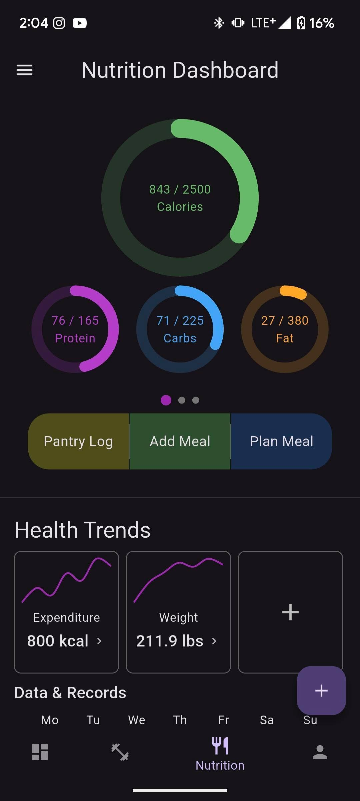
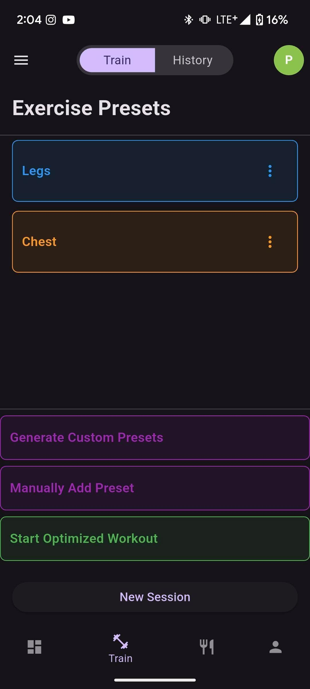
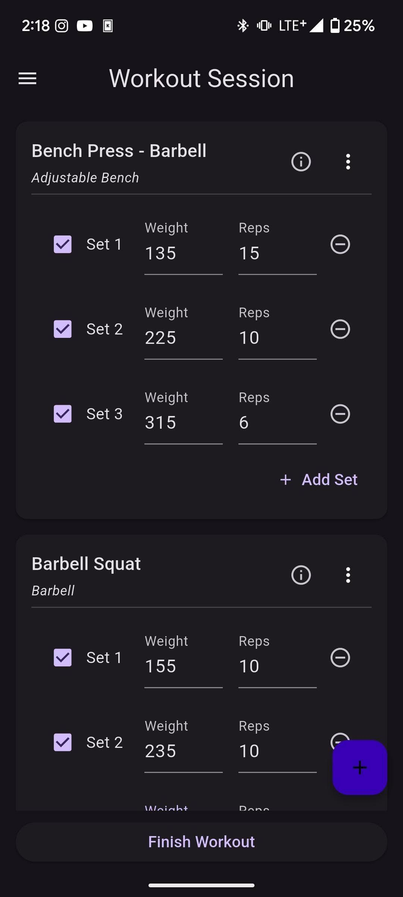
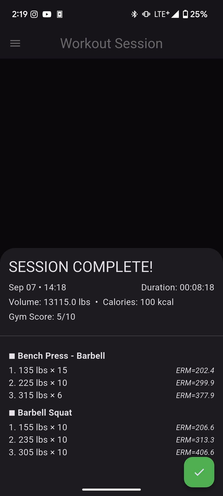
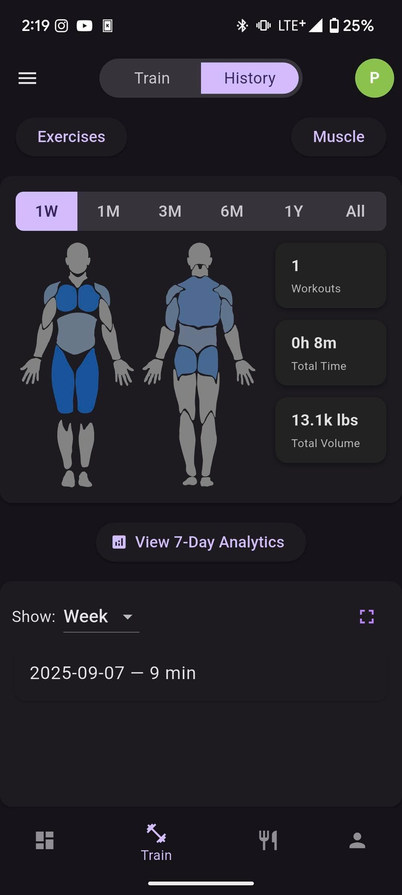

# Fitness Tracker

A local-first Flutter app for logging workouts, tracking nutrition, monitoring body measurements, and experimenting with customizable training flows and presets.

## Status

- Platform: Flutter mobile app
- State: Active work in progress
- Storage model: Local-first with SQLite
- Focus areas: Training, nutrition, analytics, and customizable presets

## Highlights

- Log full workout sessions with exercises, sets, reps, and weights
- Track nutrition with a bundled food catalog and barcode scanning support
- Review workout history, body metrics, and analytics views
- Use exercise presets and auto-preset flows for repeatable training plans
- Customize navigation, themes, onboarding behavior, and profile settings

## Screenshots

| Nutrition Dashboard | Training Presets |
| --- | --- |
|  |  |

| Active Workout Session | Workout Summary |
| --- | --- |
|  |  |

| History And Analytics |
| --- |
|  |

## What This Project Is

This repository contains an in-progress fitness application built with Flutter and SQLite. It combines several areas that are often split across multiple apps:

- strength training session logging
- cardio and stretching support
- nutrition logging with a bundled food catalog
- body measurements and trend views
- preset-based workout planning
- exercise analytics and profile-based settings

The app is designed around offline/local data storage first, with most of the application state and history stored in a SQLite database on-device.

## Current Feature Areas

### Training

- create and manage workout sessions
- log exercises, sets, reps, and weights
- support for cardio and stretch entries
- preset and auto-preset flows for repeatable routines
- exercise catalog, filters, and gym profile settings

### Nutrition

- log foods and meals
- use a bundled nutrition database
- customize foods and portions
- scan barcodes
- review daily entries and nutrition summaries

### Health Tracking

- log body measurements
- review measurement trends
- view combined history and dashboard summaries
- use visual aids such as body heatmaps and body-fat reference assets

### Customization

- onboarding flow
- configurable bottom navigation
- theme preferences
- profile and analytics settings

## Tech Stack

- Flutter
- Dart
- Provider for app state
- SQLite via `sqflite`, `sqlite3`, and `sqlite3_flutter_libs`
- SharedPreferences for local app preferences
- `fl_chart` for charting
- `flutter_svg` for vector assets
- `mobile_scanner` for barcode scanning

## Project Structure

The app is organized by responsibility:

- `lib/screens/` contains the main UI screens, grouped by feature area
- `lib/widgets/` contains reusable UI components
- `lib/providers/` contains app state and user preference state
- `lib/models/` contains typed domain models
- `lib/repositories/` contains the repository layer used by the UI
- `lib/db/` contains database helpers, schema logic, seed logic, and DAOs
- `assets/` contains lookup data, images, SVGs, and the bundled nutrition database
- `tools/catalog_builder/` contains helper scripts and data used to build the nutrition catalog

## How To Run

### Prerequisites

- Flutter SDK installed
- A configured Android, iOS, Windows, Linux, macOS, or web Flutter environment

### Install dependencies

```bash
flutter pub get
```

### Run the app

```bash
flutter run
```

### Run tests

```bash
flutter test
```

## Android Build Notes

If you want to build an Android release locally, the usual Flutter flow applies:

```bash
flutter build apk
```

The repository also contains past APK artifacts in `apk downloads/`, but those are development outputs rather than formal releases.

## How To Use The App

At a high level, the app flow is:

1. Launch the app and complete onboarding if it appears.
2. Use the bottom navigation to move between dashboard, training, nutrition, history, and profile/settings areas.
3. Start a workout session from the training area to log exercises and sets.
4. Use the nutrition pages to log foods, meals, and portion-based entries.
5. Visit settings pages to configure themes, navigation, training presets, and profile-specific options.

Because this is an actively developed personal project, some areas are more polished than others and some work is still experimental.

## Data And Assets

This project includes local seed data and bundled assets for:

- exercises
- equipment
- body parts and muscles
- stretches
- nutrition and nutrient definitions
- body-fat reference images
- a prebuilt nutrition database

The nutrition catalog tooling lives in `tools/catalog_builder/` and is separate from the main Flutter app.

## Project Status

This is an active work-in-progress application rather than a finished public release. The repository includes ongoing feature work around nutrition flows, preset generation, analytics, and UI organization.

## Notes For Visitors

- The current package name is still `env_test`, which reflects the project history more than the product name.
- Some repository contents are development-oriented, including notes, roadmap files, and generated artifacts from ongoing work.
- The default Flutter test coverage is still minimal, so this repository currently reflects active product development more than a polished library package.

## Future Improvements For The Repo

Planned repo-level improvements that would make this even easier to understand on GitHub:

- add a short demo GIF or walkthrough video
- rename the package from `env_test` to a product-facing name
- reduce tracked generated/build artifacts
- expand test coverage
- add release/download instructions for APK installs
