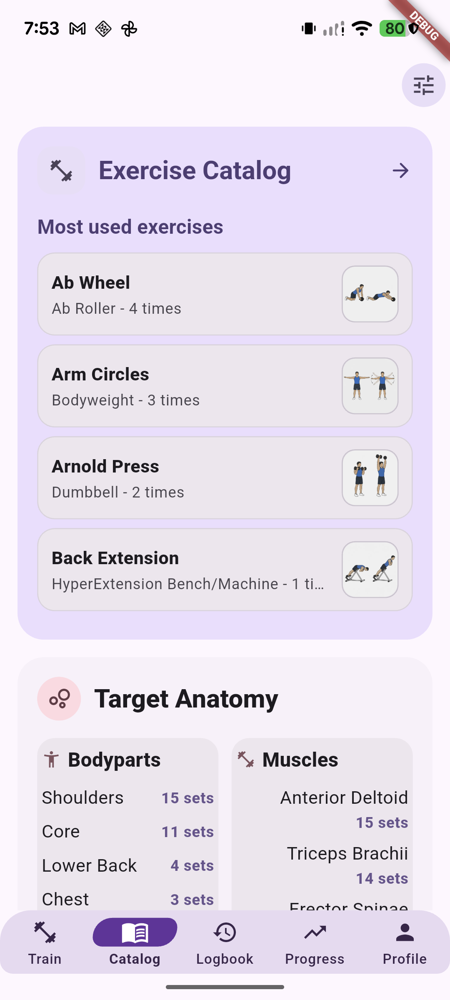
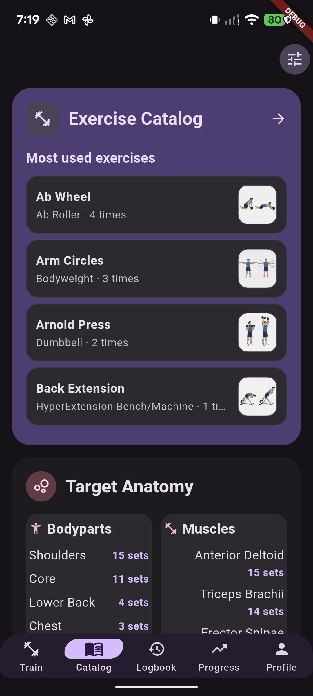

# Tonos Expressive Catalog candidate

This is a review candidate for the existing Catalog experience. It applies the isolated Expressive presentation to the real Catalog root, exercise browser, filter flow, exercise Details tab, and bodypart/muscle drilldowns. The exercise data, ordering, search and filter behavior, media loading/fallback/retry, heatmaps, and navigation remain Tonos-owned. This is a visual candidate, not a qualification or approval.

## Review captures

Captured from the isolated `com.tonos.expressivepreview` build on Pixel 7 (`28021FDH200228`). The preview uses its separate `tonos_expressive_preview.db` database. These are device screenshots; the debug ribbon is from the development build.

### Catalog root and anatomy summary

| Light | Dark |
|---|---|
|  |  |
| [Scrolled anatomy summary](review/03-root-anatomy-scrolled.png) | [Scrolled anatomy summary](review/05-root-anatomy-dark-scrolled.png) |

The anatomy summary uses independent natural pane heights so longer muscle labels and counts do not force a false equal-height constraint or overflow. [Light root anatomy before opening the drilldown](review/16-root-anatomy-light-before-route.png).

### Exercise browser, search, and filters

| Exercise list | Search results | Filter dialog | Equipment menu |
|---|---|---|---|
| [Light](review/06-exercise-browser-light.png) · [Dark](review/06-exercise-browser-dark.png) | [Dark, “squat” query](review/10-filtered-results-dark.png) | [Dark](review/08-catalog-filter-dark.png) | [Dark](review/09-catalog-filter-equipment-menu-dark.png) |

### Exercise details

| Details with exercise media | Expanded guide | Lower detail sections | Equipment expanded |
|---|---|---|---|
| [Dark](review/11-exercise-detail-dark.png) · [Light](review/15-exercise-detail-light.png) | [Form guide](review/12-exercise-detail-dark-scrolled.png) | [Equipment and target anatomy](review/13-exercise-detail-dark-lower.png) | [Barbell and plates](review/14-exercise-detail-equipment-dark.png) |

Only the Catalog Details tab opts into the new presentation. Metrics and Records, and other shared detail-sheet callers, retain their existing rendering.

### Bodypart and muscle drilldowns

| Bodypart list | Chest, light | Pectoralis Major, light |
|---|---|---|
| [Bodyparts filter](review/17-anatomy-filter-light.png) | [Bodypart detail](review/18-bodypart-detail-light.png) | [Muscle detail](review/19-muscle-detail-light.png) |

| Chest, dark | Pectoralis Major, dark |
|---|---|
| [Bodypart detail](review/20-bodypart-detail-dark.png) | [Muscle detail](review/21-muscle-detail-dark.png) |

The anatomy filter also preserves its search and heatmap fallback presentation. Fallback behavior is covered by the route/media contracts; a dedicated fallback-state device capture is not included.

## Implementation and validation

- Expressive styling is explicitly opted into by the Catalog route. Reused exercise-browser, drilldown, definition-tile, and detail-sheet widgets keep their existing defaults for non-Catalog callers.
- Root order, popular exercises, bodypart/muscle relationships, filters, exercise result content, detail sections, and workflows are preserved.
- Browser/detail and anatomy layouts were exercised at 320 dp, 411 dp where applicable, light/dark, and 1.0x, 1.15x, 1.5x, and 2.0x text scales. The Pixel 7 is 1080×2400 at 420 dpi with 1.15x system text scale.
- Focused integrated Flutter tests: **63 passed, 0 failed, 0 skipped**. The repository-wide suite was intentionally not run for this review candidate.
- Scoped Dart analysis (Dart 3.13.4): **0 errors, 0 warnings, 3 informational deprecation notices** for existing `TickerMode.of` calls in `catalog_page.dart`.
- Pixel 7 review caught an anatomy-pane overflow before the final build. It was fixed by allowing the Expressive panes to size naturally; the final light and dark captures show no overflow indicator.

Review only. This package does not qualify the Catalog slice or authorize expansion to another destination.
