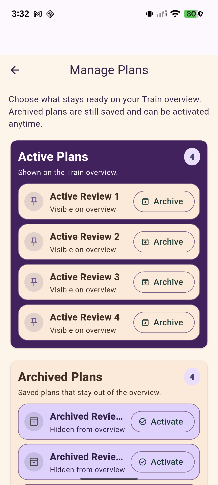
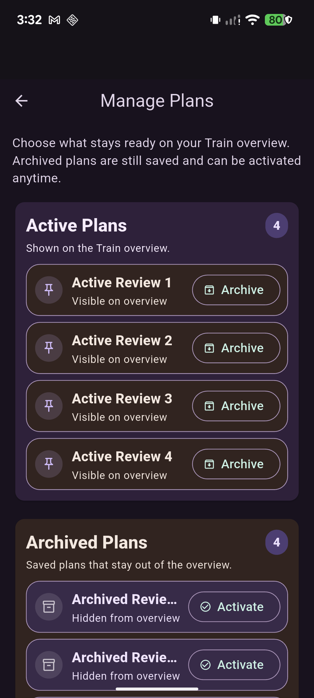
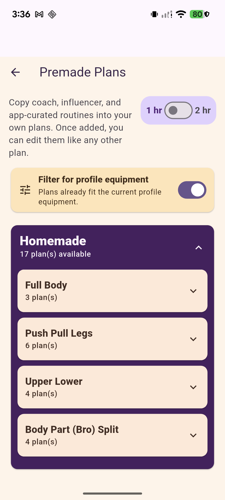
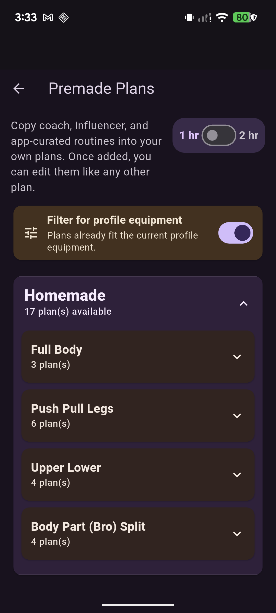
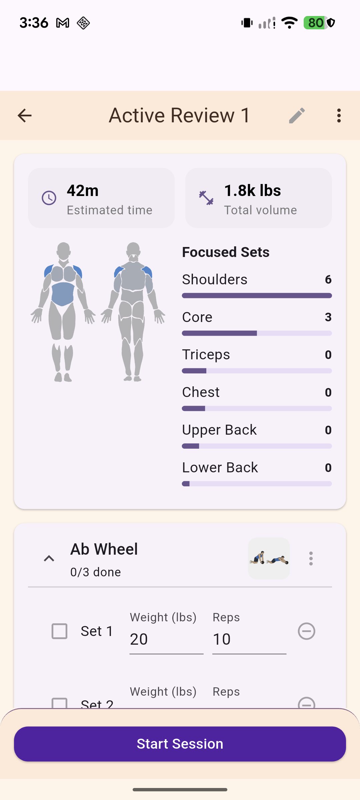
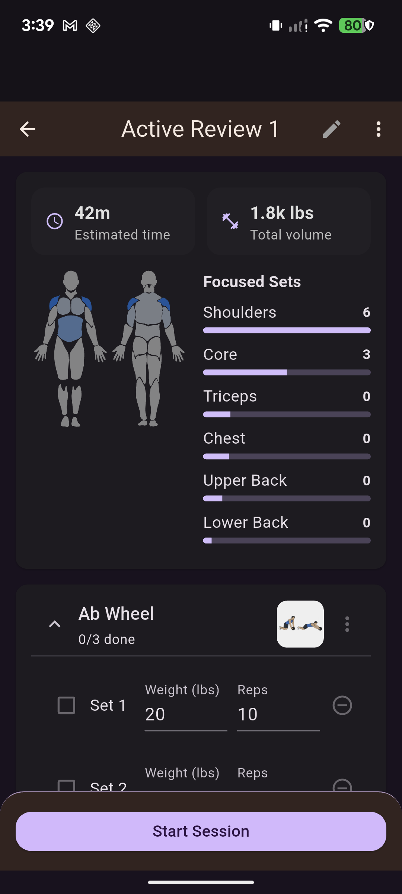
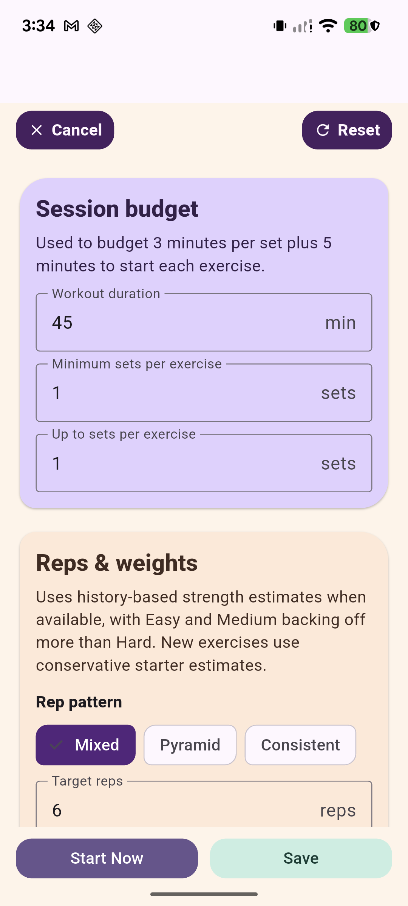
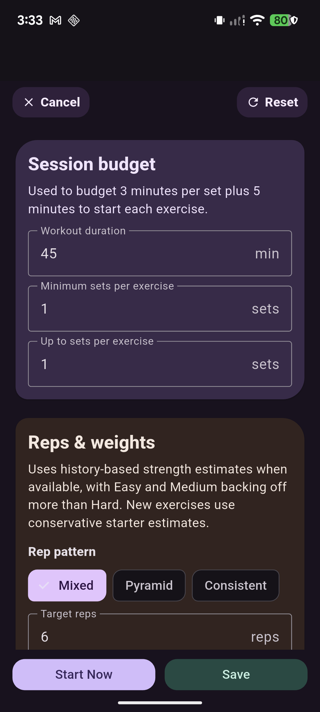
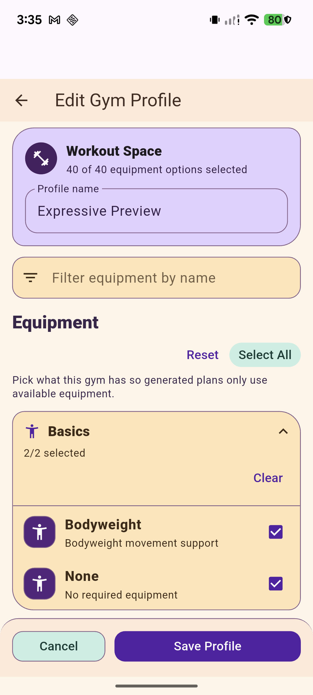
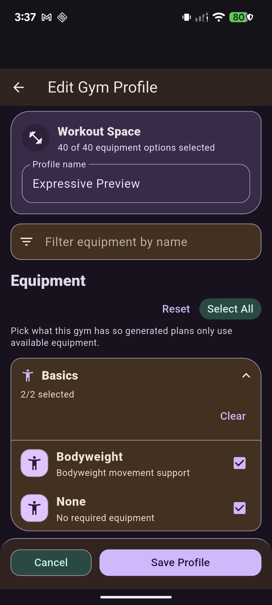

# Expressive Next Pages — Review Batch 2026-10-04

**Status: unapproved visual candidate.** These captures show five current Tonos routes under the isolated Expressive preview. They are for review and do not imply approval for wider rollout.

## Capture setup

- **Device:** Pixel 7, `28021FDH200228`, Android 16 / API 36, 1080 × 2400 capture.
- **Build:** profile APK from `tools/run_expressive_preview.ps1 -BuildMode profile`, Flutter 3.47.5 / Dart 3.13.4.
- **App identity:** `com.tonos.expressivepreview`.
- **Database:** `tonos_expressive_preview.db`, supplied through the runner’s preview Dart define. Only the isolated preview package was updated.
- **Controls:** Expressive, Curated palette, default locale/text scale, normal motion; Light for light captures and Dark for dark captures.
- **Fixtures:** invoked the preview’s Reset review controls and Reset sandbox fixtures controls. Both modes use the same seeded Expressive Preview profile, plans, and exercise data. No plan was archived/activated; no preset was edited, saved, or started; Optimized Workout Settings was exited with Cancel; Gym Profile was exited with Cancel.
- **State pairing:** each route pair uses the same seeded content and initial/top scroll position. Captures are settled stills, not animation frames.

The preview entry route is `MainScreen`. Each route below was reached through the current Train UI. Onboarding-only variants remain outside this review.

## Current routes and paired captures

| Route and navigation | Light | Dark |
| --- | --- | --- |
| **Plan Management** — Train → Plans → edit in Active Plans. Both Active and Archived groups are visible; each count is 4. |  |  |
| **Premade Plans** — Train → Plans → scroll below Active/Archived → Browse Premade Plans. The one-hour filter and expanded Homemade group are shown. |  |  |
| **Preset Detail** — Train → Plans → Active Review 1. The initial detail scroll shows summary metrics, Focused Sets, Ab Wheel and its set logging structure, plus the pinned Start Session action. |  |  |
| **Optimized Workout Settings** — Train → Overview → Optimize → gear. Defaults shown: 45 minutes, 1 minimum/maximum set, Mixed pattern, target 6 reps; actions remain untouched. |  |  |
| **Gym Profile** — Train → Overview → gym avatar → selected profile menu → Edit. Workout Space, name, equipment search, Equipment header/actions, expanded Basics group, and selected Bodyweight/None rows are shown. |  |  |

## Route-by-route visual notes

### Plan Management

- **Prior presentation:** the route used the existing Classic/Neo fallback and ordinary Tonos/Material surface treatment; the selection was a functional list grouped into Active and Archived Plans.
- **Expressive treatment:** keeps the app bar, explanatory copy, two ordered groups, count badges, and one Archive/Activate action per row. The active group becomes the focal deep-purple tonal surface with warm light rows; the archived group uses a warm grouped surface with lavender selected/archived rows. Actions remain in the original row position.
- **Dark mapping:** the focal group deepens to purple, the support group and rows map to dark brown/purple containers, foregrounds brighten, and Archive/Activate remain distinct outlined actions.
- **Behavior preserved:** active/archived ordering, counts, labels, archive/activate controls, and their callbacks. No action was triggered during review.
- **At rest:** both modes read as the same two-level grouping, and the violet/warm distinction remains legible without motion. At this device width, longer archived names display an ellipsis (`Archived Revie…`); there is no horizontal overflow in the captured state.

### Premade Plans

- **Prior presentation:** Classic/Neo fallback surfaces and standard controls framed the existing description, duration control, equipment compatibility filter, and categorized plan groups.
- **Expressive treatment:** preserves the page and group order, with a warm equipment-filter container, a strongly contained Homemade group, and light warm group cards. The one-hour/two-hour control stays in the page’s introductory area.
- **Dark mapping:** retains the same hierarchy through dark brown filter/group cards against deep purple surfaces, with light type and unchanged control placement.
- **Behavior preserved:** duration choice, compatibility filter state, category expansion, and add/copy entry points. The seeded filter has settled to “Plans already fit the current profile equipment”; no plan was copied.
- **At rest:** the screen remains a dense, scrollable catalog rather than a new dashboard. The same four Homemade categories and counts appear in both modes, with no observed clipping or overflow.

### Preset Detail

- **Prior presentation:** the route used the same detail hierarchy with the Classic/Neo fallback surfaces and standard Material fields/actions.
- **Expressive treatment:** preserves the title/edit/overflow app bar, time and volume summaries, anatomy/Focused Sets panel, exercise card/set rows, and pinned Start Session action. The dark top app bar takes the selected plan identity role; the summary and exercise regions use subdued tonal containers, and the session action remains the single prominent bottom action.
- **Dark mapping:** uses dark identity and neutral containers with pale lavender progress/primary action treatment. The series and anatomy colors remain owned by their data/identity meanings.
- **Behavior preserved:** detail/edit entry points, exercise set values and order, overflow, and the Start Session handoff. No edit, reorder, save, or start action was used.
- **At rest:** this is the same populated `Active Review 1` detail in each mode: 42m, 1.8k lbs, six Focused Sets rows, and Ab Wheel at 0/3. The lower rows continue below the viewport beneath the pinned action as in a normal scrollable detail page. A transient Android Digital Wellbeing “Used for 5h 45min” heads-up appeared in an earlier diagnostic capture; the final dark capture was retaken after it disappeared, and neither final pair image includes it.

### Optimized Workout Settings

- **Prior presentation:** existing fields and actions used the Classic/Neo fallback and standard Tonos/Material form surfaces.
- **Expressive treatment:** keeps the original vertically ordered sections and fields. Session Budget is the focal lavender tonal group; Reps & Weights is a warm supporting group. Mixed is visibly selected, fields retain their positions, and Start Now / Save remain fixed at the bottom.
- **Dark mapping:** keeps those semantic roles as deep purple/brown surfaces with light foregrounds. The dark Cancel and Reset labels were corrected to readable high-contrast foregrounds before the final APK build.
- **Behavior preserved:** Cancel, Reset, input fields, pattern choices, Start Now one-shot result, and Save persistence. Captured defaults were 45 minutes, min/max 1 set, Mixed, and target 6 reps; the route was exited with Cancel without saving or starting.
- **At rest:** the same defaults and scroll position appear in both modes. Buttons and fields remain distinct; no route-specific motion was added.

### Gym Profile

- **Prior presentation:** the route used standard fallback cards, fields, equipment groups, and selection controls.
- **Expressive treatment:** keeps the Edit Gym Profile app bar; profile identity/name card; equipment search; Equipment title and Reset/Select All actions; explanatory text; category groups; selected equipment rows; and fixed Cancel/Save actions. Purple/lavender marks selected equipment and identity; warm amber contains the Basics category; teal remains an action role.
- **Dark mapping:** the same selection/category roles map to dark brown and purple containers with brighter readable foregrounds and lavender selected-row controls.
- **Behavior preserved:** profile name, equipment count, search, category expansion, per-equipment check state, Reset/Select All, and Cancel/Save. This is the selected-profile editor, not the app Profile destination. No equipment or name was changed; the route was exited with Cancel.
- **At rest:** `Expressive Preview`, `40 of 40 equipment options selected`, expanded Basics, and its selected Bodyweight/None rows match between modes. This capture starts at the same scroll position in each mode and shows no clipping or overflow.

## Validation and implementation realism

- Combined focused route/token tests: **40 passed, 0 failed, 0 skipped** (exit 0).
- Scoped Dart analysis: **0 errors, 0 warnings, 1 existing informational deprecation** for `ReorderableListView.onReorder` in Preset Detail.
- `git diff --check`: passed (exit 0).
- Widget tests cover expressive light/dark route ownership and compact-width / approximately 2× text-scale layouts; Gym Profile also checks compact Classic/Neo behavior remains on its prior layout. The Pixel captures are normal device scale, not a 2× text-scale run.
- No full repository suite was run for this focused page batch.
- No route-specific motion was added. Existing shared `AnimatedCrossFade` durations continue to use `appMotionDuration`; Reduced Motion behavior is unchanged.
- No advanced morphing or third-party Expressive component behavior is implied by these stills; the visuals use current Flutter/Material/Tonos-owned surfaces, fields, buttons, selection controls, and route widgets.
- Pixel visual QA found no screenshot clipping, horizontal overflow, or mismatched light/dark content. The visible archived plan-name ellipsis is the only noted text truncation; it is not a new layout overflow.

## Evidence files

- [Plan Management light](plan-management/expressive-light.png) · [dark](plan-management/expressive-dark.png)
- [Premade Plans light](premade-plans/expressive-light.png) · [dark](premade-plans/expressive-dark.png)
- [Preset Detail light](preset-detail/expressive-light.png) · [dark](preset-detail/expressive-dark.png)
- [Optimized Workout Settings light](optimized-workout-settings/expressive-light.png) · [dark](optimized-workout-settings/expressive-dark.png)
- [Gym Profile light](gym-profile/expressive-light.png) · [dark](gym-profile/expressive-dark.png)

The route hierarchy XML dumps used during capture are kept beside each image as inspection evidence. They are not required to review the PNGs.
